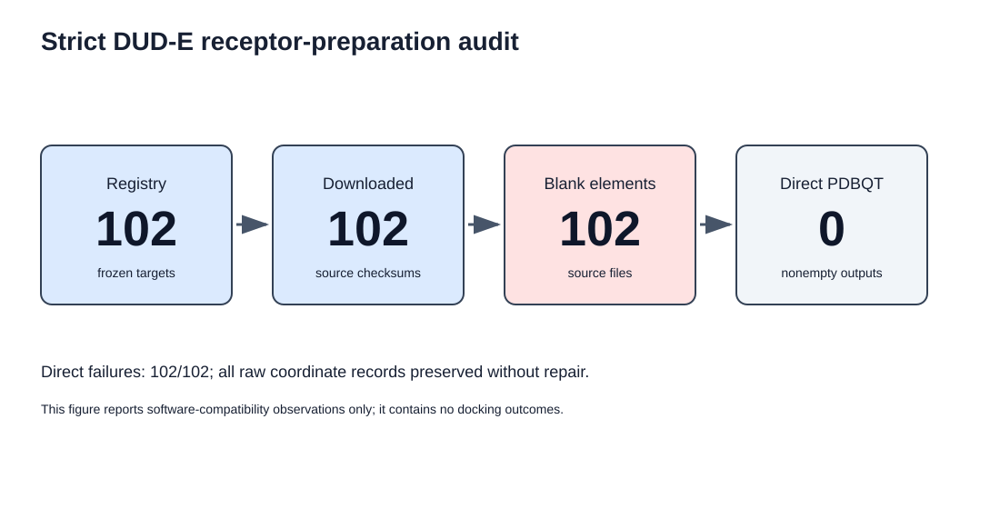
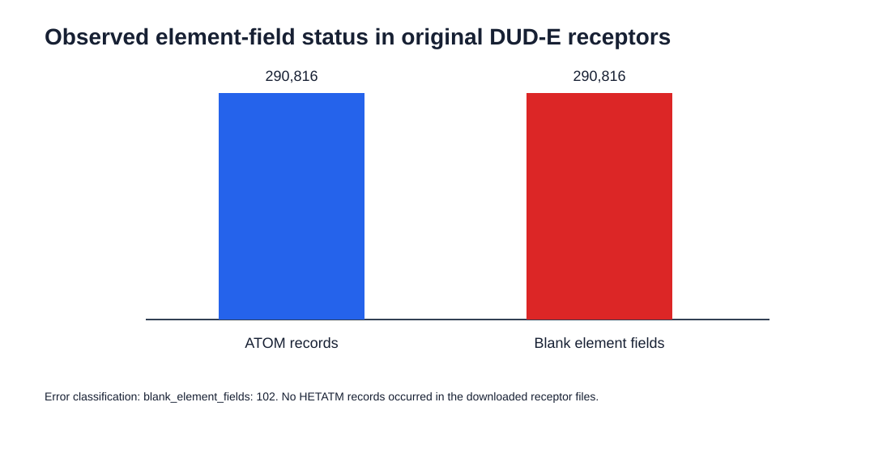

# Strict DUD-E receptor-preparation audit: observed results

## Dataset and execution

The frozen registry contains 102 DUD-E targets. The audit downloaded each
target's original `receptor.pdb` directly from DUD-E, retained a SHA-256
checksum for every source file, and invoked Meeko 0.7.1 once per file using its
direct PDB reader. No source file was edited or repaired.

## Observed compatibility outcome

All 102 downloads completed and yielded 102 distinct source checksums. Across
the original files, the audit observed 290,816 `ATOM` records and zero
`HETATM` records. Every one of the 290,816 coordinate records had a blank PDB
element field.

All 102 direct Meeko preparation attempts failed with the recorded RDKit
message `Element '' not found`; no nonempty PDBQT was produced. This is an
observation for the frozen input source and the declared direct-reader software
configuration. It does not establish that these proteins cannot be prepared by
other explicit, reviewed workflows, nor does it measure docking performance.

## Interpretation

The exact DUD-E receptor representation is not directly compatible with this
strict Meeko/ RDKit configuration because the PDB element field is empty across
the audited coordinate records. The result exposes a reproducibility boundary:
any workflow that proceeds must state and validate how elements are recovered
or which alternative source representation is used. This repository does not
apply such a transformation.

The complete target-level results, source URLs and SHA-256 values are in
[`results/dude_receptor_audit.csv`](../results/dude_receptor_audit.csv).
