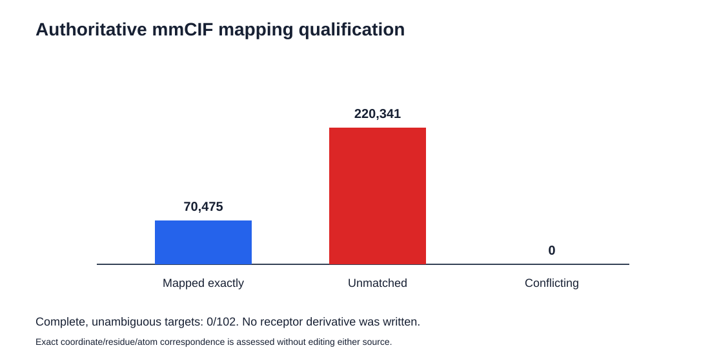

# Authoritative element-mapping qualification: observed results

## Scope

This phase evaluated whether the original DUD-E receptor coordinates could be
matched, without editing, to the corresponding authoritative RCSB PDBx/mmCIF
atom sites. The mapping key used residue name, author residue number, atom name
and coordinates rounded to three decimal places. Chain identity was omitted
because the DUD-E receptor representation lacks it.

## Results

All 102 RCSB mmCIF files were acquired and checksummed. Of 290,816 DUD-E `ATOM`
records, 70,475 (24.23%) had an exact mapping to an RCSB atom-site key and
220,341 (75.77%) did not. No key produced conflicting official element symbols,
but no target had a complete, unambiguous mapping: 0/102 passed the gate.

## Decision

The Phase 2 gate is not passed. The audit therefore does not create a
field-restored receptor and does not rerun Meeko on a derivative. The partial
coordinate correspondence shows that a seemingly simple element recovery would
mix different structural representations for most source records.

This is not evidence that the RCSB structures are incorrect, nor a docking
result. It documents that an automatic, atomwise transfer from the selected
authoritative source cannot be justified for the frozen DUD-E receptor files
under the prespecified exact-correspondence rule.

The complete target-level table is in
[`results/dude_rcsb_element_mapping.csv`](../results/dude_rcsb_element_mapping.csv).
