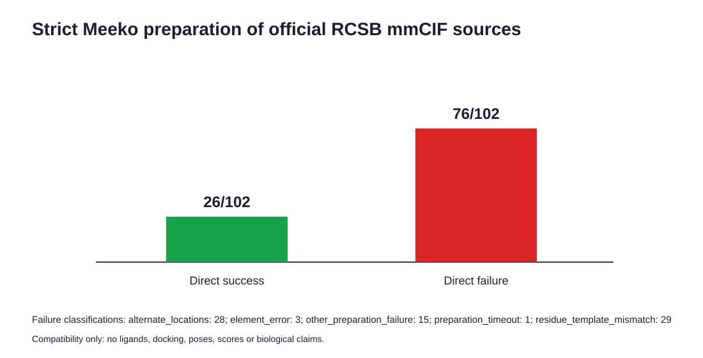

# Strict RCSB mmCIF preparation audit: observed results

The same frozen 102 PDB identifiers were evaluated using the official RCSB
PDBx/mmCIF source files and Meeko's ProDy reader. This source-alternative audit
is separate from the original DUD-E receptor representation.

Of 102 attempts, 26 produced a nonempty receptor PDBQT and 76 failed under the
strict protocol. Failures were classified from the retained logs as 29 residue
template mismatches, 28 alternate-location cases, 15 other preparation
failures, three element errors and one timeout.

These are software-compatibility outcomes only. Successful PDBQT generation
does not validate a receptor choice, docking box, pose, docking score, affinity
or biological activity. No ligand was prepared and no docking was executed.

The complete target-level table is in
[`results/rcsb_mmcif_preparation_audit.csv`](../results/rcsb_mmcif_preparation_audit.csv).
